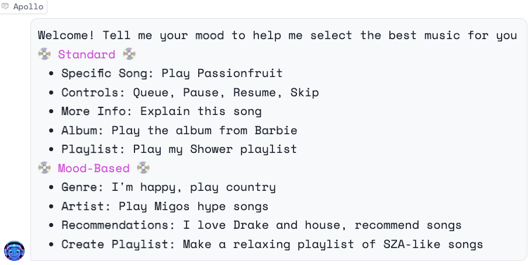

# Project Overview

This project is a comprehensive music recommendation and control system. It leverages Spotify's Web API and OpenAI's GPT-4 model to deliver a highly personalized and interactive music experience. 

Mood-based recommendations and automatic playlist creation are just a command away! This project serves as a fun example of how APIs, machine learning models, and natural language processing can be combined to create useful applications.

Try it out [here](https://huggingface.co/spaces/sjw/Spotify-Chatbot) and watch the [informational video](link).

## Resources

### Project Inspiration
- [Spotify Langchain ChatGPT](https://jonathansoma.com/words/spotify-langchain-chatgpt.html)
- [AI for You: 4 Predictions for Spotify DJ](https://bootcamp.uxdesign.cc/ai-for-you-4-predictions-for-spotify-dj-b968c60488db)

### Custom Functions
- [Custom Functions with OpenAI Functions Agent](https://python.langchain.com/docs/modules/agents/how_to/custom-functions-with-openai-functions-agent)
- [Spotipy Documentation](https://spotipy.readthedocs.io/en/2.22.1/)
- [Use OpenAI Function instead of LangChain ReAct Agent Tool in 10 minutes](link)

### Chatbot Interface
- [Creating a Custom Chatbot with Blocks](https://www.gradio.app/guides/creating-a-custom-chatbot-with-blocks)
- [Theming Guide](https://www.gradio.app/guides/theming-guide)

### Mood Detection
- [Sentence Similarity](https://huggingface.co/tasks/sentence-similarity)
- [OpenAI Chat](https://chat.openai.com/share/7066590c-36b9-4ddf-9f5f-3dc9e5194f8a)

### User Isolation
- [State in Blocks](https://www.gradio.app/guides/state-in-blocks)
- [Spotify Web API Tutorials: Implicit Flow](https://developer.spotify.com/documentation/web-api/tutorials/implicit-flow)

### Future Improvements
- [Fine-tuning a model for this application](https://platform.openai.com/docs/guides/fine-tuning/preparing-your-dataset)
- Adding audio
- [How to Talk to Your Langchain Agent | 11 Labs + Whisper](link)

For any feedback, please reach out to me at [stuart.j.waller@vanderbilt.edu](mailto:stuart.j.waller@vanderbilt.edu).
